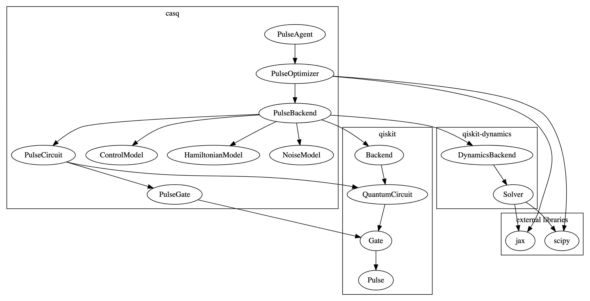

.. _overview:

################################################################################
Overview
################################################################################

Casq is a Python toolkit which provides tools for control and analysis of superconducting qubits. These tools include building blocks in the form of pulse gate, circuit, model, backend and optimizer classes, as well as methods for solving ODEs and optimization to support optimal control, calibration, characterization, and learning for quantum systems based on superconducting qubits.

Motivation & Goals
================================================================================

The main motivation is to build a software toolkit which supports research in developing more accurate and performant approaches for optimizing control pulses and improving fidelity of superconducting qubits. The toolkit will help speed up and eliminate time wasted in repetitive research tasks by providing an easily extendable framework with features such as

* consistent push-button plotting/reporting,
* comparative access to similar functionalities in other open-source libraries,
* helping focus on research goals such as improving performance/accuracy or introducing agent- or learning-based approaches, and
* reproducibility of findings.

Approach
================================================================================

* Qiskit will used as a foundation for basic building blocks such as quantum gates, circuits, and backend since it provides a hardware-agnostic interface which is widely-used (hence significantly lowering the learning curve for using Casq). There is already support for converting Qiskit objects in major libraries planned for support, i.e. QuTiP and C3.
* Since QuTiP and C3 are rather mature/stable libraries and qiskit-dynamics is under rapid development with breaking changes, using Qiskit as foundation will help build a thinner abstraction wrapping various libraries together. Furthermore, qiskit-dynamics provides convenient hooks so that additional external libraries for ODE solvers, optimization algorithms, and so on can be added in a straightforward manner. The support for Hamiltonian and Lindblad models also seem to provide a more flexible approach than other libraries for implementing different quantum systems?
* Need to build a more simple and intuitive skeleton compared to the other libraries since this is a focused toolkit rather than trying to do everything related to simulating quantum dynamics as in qiskit-dynamics or QuTiP. Even C3, though more focused on optimal control, has a rather complicated structure and a wide area of focus - can it be simplified without losing much?
* Model development should be easy and intuitive so that various qubit and QPU architectures can be introduced rapidly. Developing a DSL for building models is probably best approach.
* Focus on Python project best practices from the start!

Architecture
================================================================================

The architecture is based on an object model consisting of a layered lego approach where each higher-level object abstraction uses lower-level blocks starting from the most basic building block of a pulse.

   Casq object model
